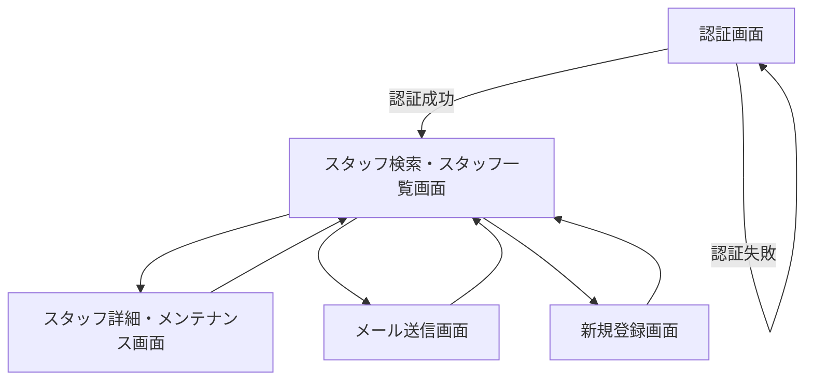

# 画面遷移 (デザインルール含む)

このセクションでは、アプリケーションの主要な画面とその間の遷移、およびUI/UXに関する基本的なデザインルールを記述します。

### 画面遷移図

### 主要画面フロー

以下に、主要な画面遷移の例を示します。

* **認証画面**
    * ユーザーがuser_codeとパスワードを入力し、`USERS`テーブルの`user_code`と`password`を照合して認証が成功すると「スタッフ検索・スタッフ一覧画面」へ遷移します。
    * 認証失敗の場合は、エラーメッセージが表示され、認証画面にとどまります。
* **スタッフ検索・スタッフ一覧画面**
    * ログイン後の初期画面として表示されます。
    * スタッフの検索、フィルタリング、ソート機能を提供し、一覧で表示します。
    * この画面から以下の主要な分岐へ進めます。
        * **スタッフ単独の表示・メンテナンス画面**: 特定のスタッフを選択・クリックすることで、そのスタッフの詳細情報を表示・編集できる画面へ遷移します。
        * **抽出したスタッフに対するメール送信画面**: 検索・フィルタリングによって抽出された（または選択された）スタッフに対して、システムから一括メールを送信するための画面へ遷移します。
        * **新規登録画面**: 新しいスタッフ情報を登録するための画面へ遷移します。
* **スタッフ単独の表示・メンテナンス画面**
    * 選択されたスタッフの氏名、連絡先、所属などの詳細情報を表示します。
    * スタッフ情報の編集、更新、削除が可能です。
    * 完了後、「スタッフ検索・スタッフ一覧画面」に戻ります。
* **抽出したスタッフに対するメール送信画面**
    * 送信対象となるスタッフのリスト（または人数）が表示されます。
    * メールの件名、本文を入力し、必要であれば添付ファイルを追加できます。
    * 送信実行後、送信結果（成功・失敗）が表示され、「スタッフ検索・スタッフ一覧画面」に戻るか、送信履歴を確認するオプションが提供されます。
* **新規登録画面**
    * 新規スタッフ情報を入力し、システムに登録します。
    * スタッフ詳細画面と同様のUIを流用することが想定されます。

### デザインルール

* **一貫性**: アプリケーション全体で統一されたUI要素（ボタン、入力フィールド、フォント、カラーパレット）を使用し、特に「Kintoneのような」操作感を目指します。シンプルで直感的な操作性を重視します。
* **視認性**: テキストと背景のコントラストを確保し、読みやすいフォントサイズと行間を設定します。情報の表示は整理され、一目で理解できるように努めます。
* **操作性**: 主要な操作は直感的でアクセスしやすい場所に配置し、ユーザーが迷わずに目的を達成できるようにします。特に「スタッフ検索・スタッフ一覧画面」では、検索・フィルタリング・選択の操作をスムーズに行えるよう工夫します。単数選択と複数選択の切り分けを明確にし、選択によって有効になる操作（詳細表示ボタンなど）を視覚的に示します。
* **レスポンシブデザイン**: PC、タブレット、スマートフォンなど、様々なデバイスサイズに対応できるよう、レスポンシブなレイアウトを採用し、どの環境でも快適に利用できることを目指します。
* **エラーハンドリング**: ユーザーの入力エラーやシステムエラーに対して、明確で分かりやすいメッセージを表示し、適切な誘導を行います。
* **フィードバック**: 処理の完了、エラー、ローディングなど、ユーザーのアクションに対するシステムからのフィードバックを視覚的・即座に提供します。

### 通知・メッセージシステム

本アプリケーションでは、以下の2種類の通知・メッセージシステムを採用します：

#### 1. Toast通知（Snackbar）
* **用途**: 操作の結果を即座にフィードバックする短期間表示メッセージ
* **表示位置**: 画面右上に固定表示
* **表示時間**: 3秒間自動で表示後、スライドアウトアニメーションで消失
* **スタイル**: Material Design準拠のSnackbar形式
* **使用例**:
  - ファイルアップロード成功/失敗
  - データ保存完了
  - 下書き保存完了
  - システム通知

#### 2. Modal Dialog（確認ダイアログ）
* **用途**: ユーザーの重要な操作確認や警告表示
* **表示位置**: 画面中央にオーバーレイ表示
* **操作**: 「キャンセル」「実行」ボタンでユーザー選択を要求
* **閉じ方**: ESCキー押下、背景クリック、キャンセルボタン
* **使用例**:
  - メール送信確認
  - データ削除確認
  - ログアウト確認
  - 入力内容破棄確認
* **色使い**: デザインにおける色使いは、[note.com の記事](https://note.com/ash/n/n82b11075119a) に記載されている考え方を参考に、ユーザーにとって視覚的に快適で情報が伝わりやすい配色を心がけます。

### アクセシビリティガイドライン

* WCAG 2.1 AA 準拠: コントラスト比、キーボード操作対応、スクリーンリーダー向けのラベル付与など。
* フォーカスインジケータ: フォーカス時に視覚的に分かりやすいインジケータを表示。
* ARIA属性: 適切なARIAロールやラベルを追加し、支援技術での利用をサポート。

### コンポーネントライブラリ

* 共通UI: ボタン、入力フィールド、モーダル、アラートなどは再利用可能なコンポーネントとしてライブラリ化。
* MaterialUI: コンポーネントにはMaterialUIを利用。
* デザイントークン: カラー、スペース、タイポグラフィなどをトークンとして定義し、一元管理。

### タイポグラフィとブレークポイント

* フォント: 主要フォントはBIZ UDゴシック（数字はOCR-B）を使用、フォントサイズは基準16px、見出しに応じてスケーリング。
* レスポンシブブレークポイント: 小画面 ~640px、中画面 641px〜1024px、大画面 1025px〜1920px でレイアウトを切り替え。
* グリッドシステム: 12カラムグリッドをベースに、コンテンツ幅と余白を柔軟に調整。
