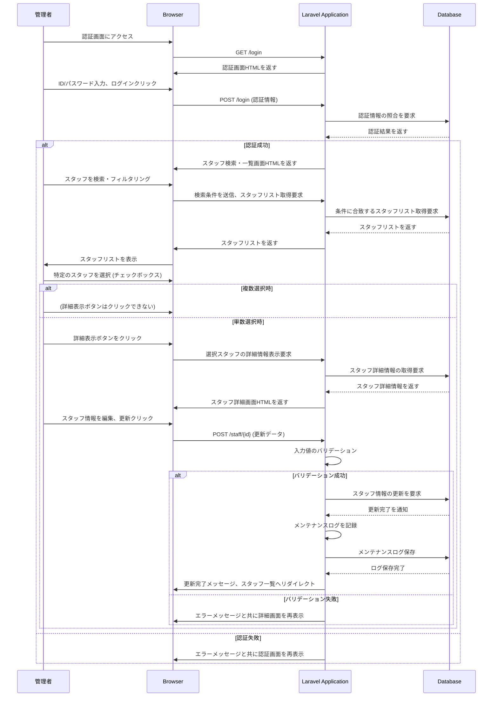
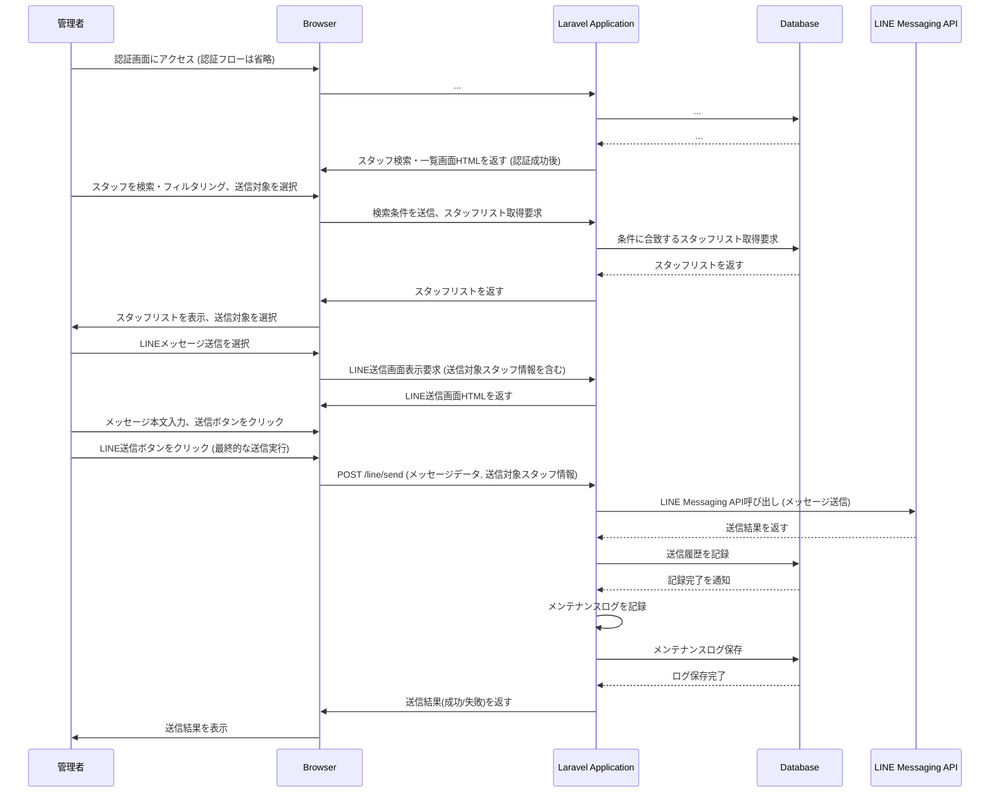
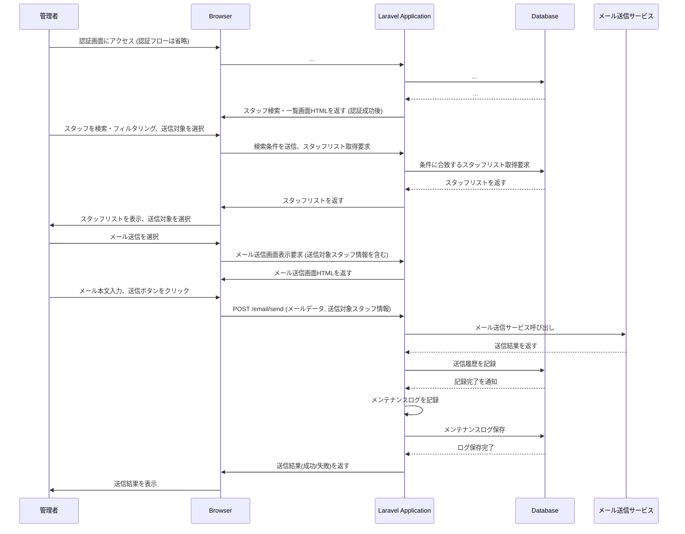
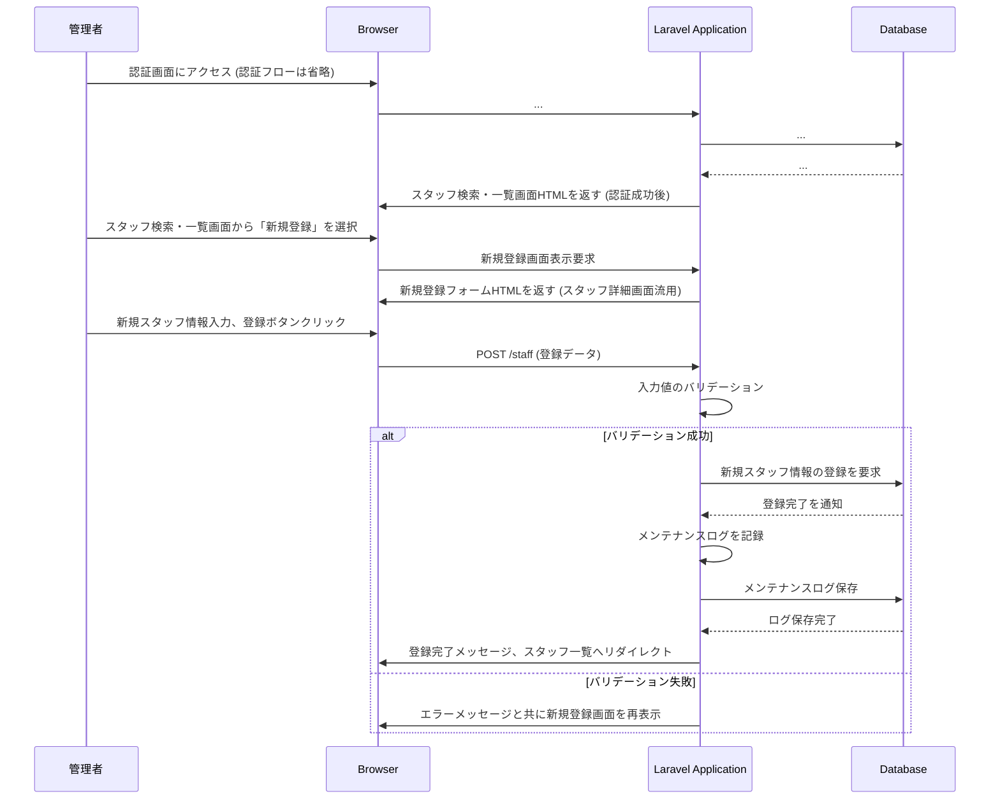
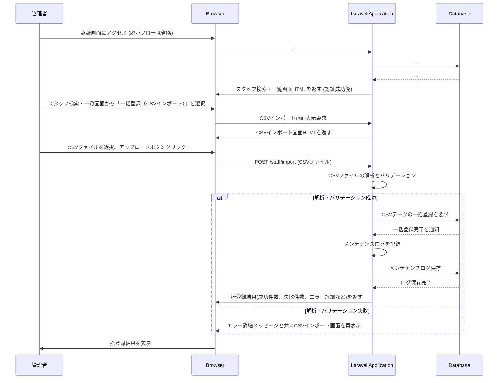

# シーケンス

このセクションでは、主要な機能におけるシステムとユーザー、および外部システム（LINE APIなど）とのインタラクションのシーケンス図を記述します。

### 登場人物（アクターとシステムコンポーネント）

* **管理者** (AdminUser): システムを操作する全権管理者または一般管理者。
* **ブラウザ** (Browser): Webブラウザ。
* **Laravel Application** (WebServer): PHP Laravelで構築されたWebアプリケーションサーバー。
* **データベース** (Database): スタッフ情報やシステムデータを管理するデータベース。
* **LINE Messaging API** (LineAPI): LINE公式アカウントと連携するためのAPI。
* **メール送信サービス** (MailService): システムからメールを送信するための外部サービス（例: SendGrid, Postmarkなど）。

### ① 認証 ⇒ スタッフ検索・一覧 ⇒ スタッフ詳細画面でのメンテナンス＆登録

### ② 認証 ⇒ スタッフ検索・一覧 ⇒ LINE送信画面から本文入力し送信

### ③ 認証 ⇒ スタッフ検索・一覧 ⇒ メール送信画面から本文入力し送信

### ④ 認証 ⇒ スタッフ検索・一覧 ⇒ 新規登録画面からエントリ（スタッフ詳細画面を流用）

### ⑤ 認証 ⇒ スタッフ検索・一覧 ⇒ 一括登録（CSVインポート）

  
## 非同期処理とパフォーマンス最適化

* バッチ送信: LINE一括通知やメール送信はジョブキュー（Redis + Laravel Queue）で非同期実行し、ユーザー操作をブロックしない。
* 進捗表示: 長時間ジョブの進捗はWebSocket（Laravel Echo）でフロントエンドにリアルタイム通知。
* キャッシュ: 頻繁に参照するスタッフ一覧や設定情報はRedisキャッシュを利用し、DB負荷を軽減。
* 負荷試験: k6やJMeterを使用した負荷試験プランを作成し、ピーク時の性能を検証。

## 入力値バリデーションの適用場所

* **フロントエンド（React）**: フォームコンポーネント内で必須チェック、形式チェック、リアルタイムエラー表示を行い、ユーザー体験を向上させます。
* **サーバーサイド（Laravel）**: コントローラーで直接実装するか、FormRequestクラスを利用してリクエスト受信時にバリデーションを実行し、不正データを排除します。

## セキュリティとエラーハンドリング

* CSRF保護: 全てのフォームとAPIエンドポイントにCSRFトークン検証を実装し、不正リクエストを防止。
* セッション管理: セッションタイムアウト、IPアドレス／User-Agentチェックによるセッション固定攻撃対策。
* バックエンドAPIバージョニング: `/api/v1/...` のようにバージョンを明示し、後方互換性を確保。
* エラーレスポンス: 4xx／5xxエラー時に標準化したJSON形式（error_code, message, details）を返却し、クライアントで適切にハンドリング。