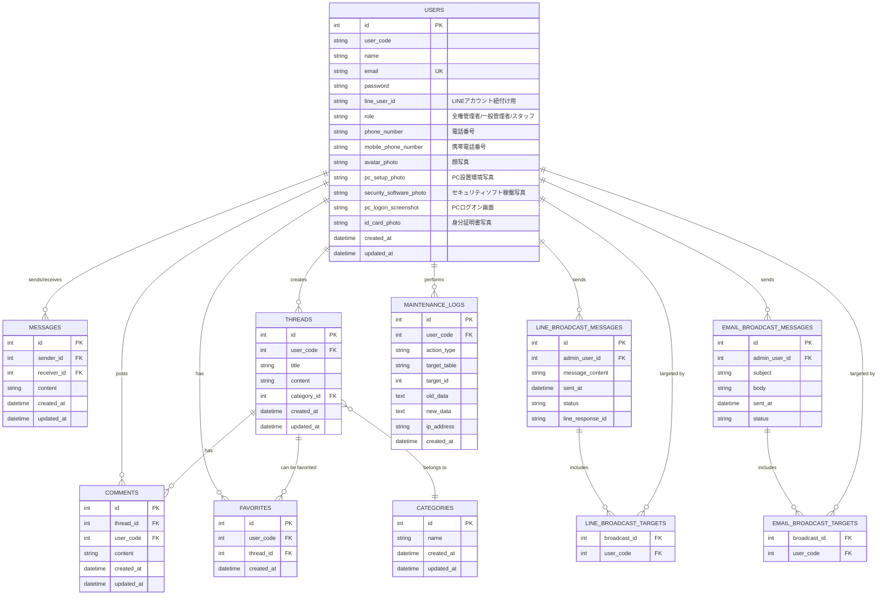

# ER図

このセクションでは、アプリケーションのデータベース構造を表すエンティティリレーションシップ図 (ER図) を記述します。これは、データの関連性や整合性を理解するために重要です。

### 主要エンティティの例

## エンティティ説明

**USERS**: システムのメンバー情報。line_user_id はLINEアカウントとの紐付けに利用します。role には「全権管理者」「一般管理者」「スタッフ」の分類を保持します。phone_number (電話番号) と mobile_phone_number (携帯電話番号) を追加しました。
さらに、メンバーの顔写真、PC設置環境写真、セキュリティソフト稼働写真、PCログオン画面のスクリーンショット、身分証明書写真を保持するフィールドを追加しました。

**MESSAGES**: 個別メッセージの送受信履歴。

**THREADS**: 掲示板のトピック。

**COMMENTS**: 掲示板のトピックに対するコメント。

**CATEGORIES**: 掲示板トピックのカテゴリ。

**LINE_BROADCAST_MESSAGES**: LINE一括送信メッセージの履歴。どの管理者が送信したか(admin_user_id)、送信結果(status)、LINEからのレスポンスIDなどを記録します。

**EMAIL_BROADCAST_MESSAGES**: メール一括送信メッセージの履歴。同様に送信した管理者や送信結果を記録します。

**LINE_BROADCAST_TARGETS**: LINE一括送信メッセージが誰に送られたかを記録する中間テーブル（多対多のリレーション）。

**EMAIL_BROADCAST_TARGETS**: メール一括送信メッセージが誰に送られたかを記録する中間テーブル（多対多のリレーション）。

**MAINTENANCE_LOGS**: システムのメンテナンス履歴を記録するログテーブル。誰が(user_code)、いつ(created_at)、何を(action_type)、どのデータ(target_table, target_id)に対して、どのように(old_data, new_data)操作したかを記録します。操作元のIPアドレスも記録することで、セキュリティ監査に役立てます。

**FAVORITES**: ユーザーが掲示板の記事をお気に入り登録した履歴を管理するテーブル。user_code と thread_id の組み合わせで、どのユーザーがどの記事をお気に入り登録したかを記録します。
