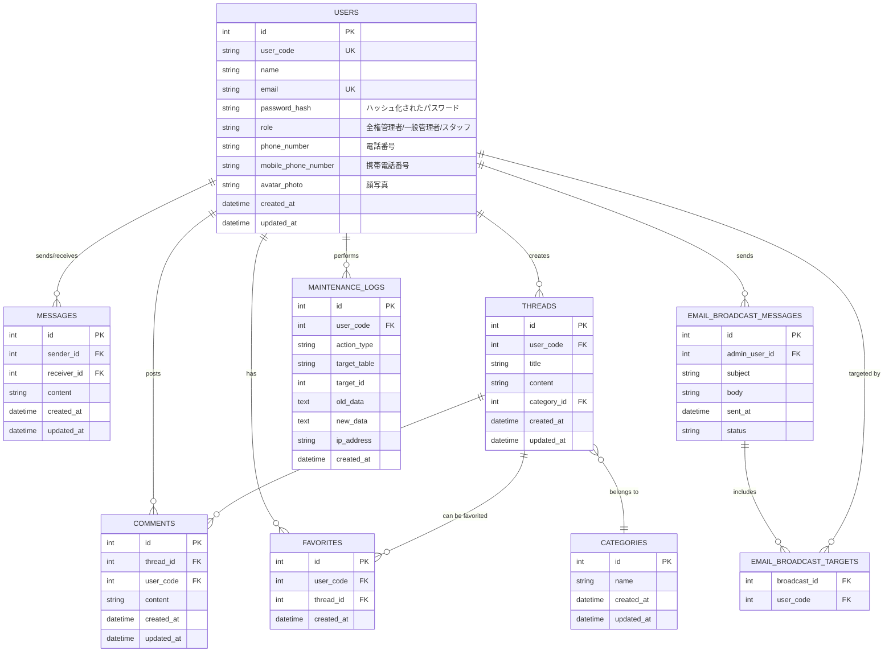

# ER図

このセクションでは、アプリケーションのデータベース構造を表すエンティティリレーションシップ図 (ER図) を記述します。これは、データの関連性や整合性を理解するために重要です。

### 主要エンティティの例

## エンティティ説明

**USERS**: システムのメンバー情報。role には「全権管理者」「一般管理者」「スタッフ」の分類を保持します。phone_number (電話番号) と mobile_phone_number (携帯電話番号) を追加しました。
avatar_photo フィールドでメンバーの顔写真を保持します。
**セキュリティ**: password_hash フィールドにはbcryptアルゴリズムでハッシュ化されたパスワードを保存し、平文パスワードは保存しません。user_code フィールドにユニーク制約を追加し、認証に使用します。

**MESSAGES**: 個別メッセージの送受信履歴。

**THREADS**: 掲示板のトピック。

**COMMENTS**: 掲示板のトピックに対するコメント。

**CATEGORIES**: 掲示板トピックのカテゴリ。

**EMAIL_BROADCAST_MESSAGES**: メール一括送信メッセージの履歴。どの管理者が送信したか(admin_user_id)、送信結果(status)などを記録します。

**EMAIL_BROADCAST_TARGETS**: メール一括送信メッセージが誰に送られたかを記録する中間テーブル（多対多のリレーション）。

**MAINTENANCE_LOGS**: システムのメンテナンス履歴を記録するログテーブル。誰が(user_code)、いつ(created_at)、何を(action_type)、どのデータ(target_table, target_id)に対して、どのように(old_data, new_data)操作したかを記録します。操作元のIPアドレスも記録することで、セキュリティ監査に役立てます。

**FAVORITES**: ユーザーが掲示板の記事をお気に入り登録した履歴を管理するテーブル。user_code と thread_id の組み合わせで、どのユーザーがどの記事をお気に入り登録したかを記録します。
